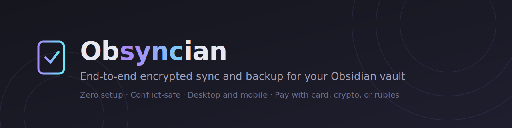

# Obsyncian

**End-to-end encrypted sync and backup for your Obsidian vault — with none of the setup.** No buckets, no servers, no Git. Built for people priced out of other options: twice the storage per dollar, and you can pay with a bank card, crypto, or rubles.

**[Website](https://obsyncian.com)** · **[Telegram bot](https://t.me/ObsyncianOfficialBot)** · **[Pricing](https://obsyncian.com/#pricing)** · **[Privacy policy](https://obsyncian.com/privacy)**

---

## Why Obsyncian

🔐 **We can't read your notes.** Set an encryption passphrase when linking your vault (strongly recommended) and file contents **and file names** are encrypted on your device — AES-256-GCM with a PBKDF2-derived key (600k iterations) — before anything is uploaded. Our servers and storage only ever see ciphertext and random IDs. Without a passphrase, sync works but data is stored unencrypted.

🛟 **Your notes can't be silently lost.** Every change is version-checked on the server, so two devices can never overwrite each other. If you edit the same note in two places, you get *both* versions — one saved next to the original as `Name (conflict 2026-07-04 1130).md`. Deletes are reversible tombstones with version history retained for 30–90 days.

⚡️ **Zero setup.** Install → get a login code from our Telegram bot → set a passphrase → done. No VPS, no SSH keys, no CouchDB, no cloud-storage accounts to wire up.

📱 **Desktop and mobile.** Windows, macOS, Linux, iOS, Android. Syncs while the app is open (mobile operating systems don't allow background sync for any plugin).

👥 **Share a vault** (paid plans): invite someone right from the Telegram bot — they accept with one tap and the vault appears in their plugin as "@you — Vault name". Revoke access just as easily.

💳 **Payment that works where you live.** Bank card (₽, with auto-renew), or any cryptocurrency via Telegram's Crypto Bot. Free 100 MB tier — no card required.

## Screenshots

| Sync status panel | Settings |
|---|---|
|  |  |

*The sidebar panel shows live progress while syncing, a report of what moved (downloaded / uploaded / conflicts), and any errors — plus Pause/Resume for when you're on a metered connection.*

## Getting started

1. Install and enable the plugin, then open **Settings → Obsyncian**.
2. Log in with Telegram: press **Continue with Telegram**, open the bot, and enter the code it sends you. (Email codes work too.)
3. Set an encryption passphrase (strongly recommended — this is what makes your data unreadable to us).
4. Create a synced vault, or link an existing one from another device.

Sync runs automatically on file changes and on an interval. Commands: **Sync now**, **Pause/resume sync**, **Open sync status**.

## FAQ

**What happens if I forget my passphrase?**
Your synced data becomes unrecoverable — that's the flip side of real end-to-end encryption. Your local files are untouched; reset and re-sync with a new passphrase.

**What about conflicts?**
Nothing is merged and nothing is lost: the losing version is written next to the file as a conflict copy. Same model as official Obsidian Sync.

**How is it cheaper than alternatives?**
Architecture: encrypted file bytes travel directly between your device and object storage via short-lived signed URLs — they never pass through our servers. That's radically cheaper to run, and the price reflects it.

## Disclosures (per Obsidian developer policies)

- **Account required** for the plugin to function. A free tier is available.
- **Payment required for full access.** Free: 100 MB, 1 vault. Paid plans (more storage, more vaults, larger files, vault sharing) are purchased outside the plugin via our [Telegram bot](https://t.me/ObsyncianOfficialBot) — crypto or bank card. When you exceed quota, sync stops accepting new data; existing data stays downloadable.
- **Network use.** The plugin talks to the Obsyncian API (`obsyncian.com` by default) for authentication and sync metadata, and transfers encrypted file data directly to Cloudflare R2 object storage via short-lived signed URLs. No other remote services are used.
- **Server code.** This plugin is open source (MIT) — including all encryption code, which is auditable here. The server implementation is currently closed-source.
- **Telemetry.** The plugin sends no telemetry. Server-side we keep operational records (account identity, request metadata, storage usage) as described in the [privacy policy](https://obsyncian.com/privacy).
- **Lost passphrases make synced data unrecoverable** — see FAQ above.

## Self-hosting

The plugin lets you point **Server URL** at any compatible API instance. The server implementation is not published yet; a self-hosting guide is planned.

---

Obsidian is a trademark of Dynalist Inc. Obsyncian is an independent project, not affiliated with or endorsed by Obsidian.
